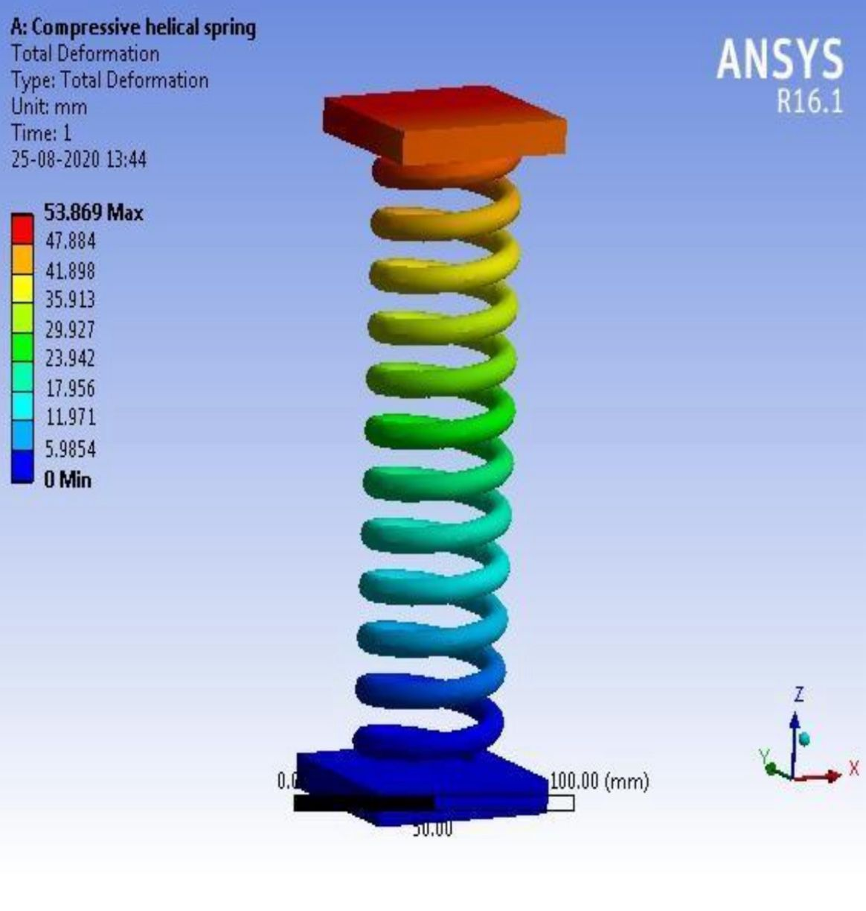
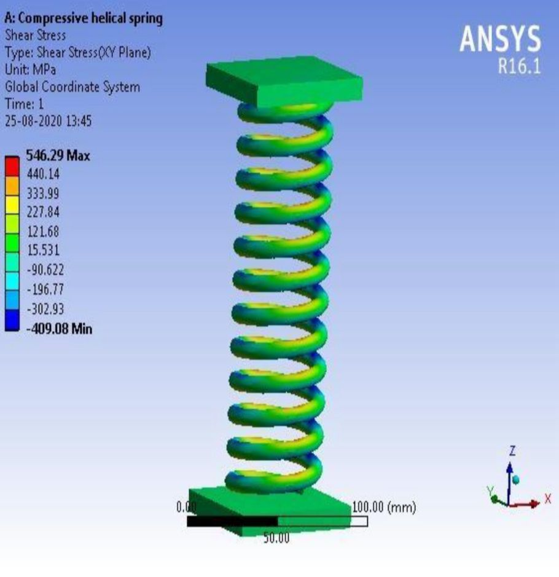
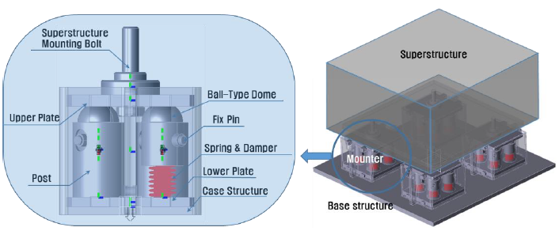
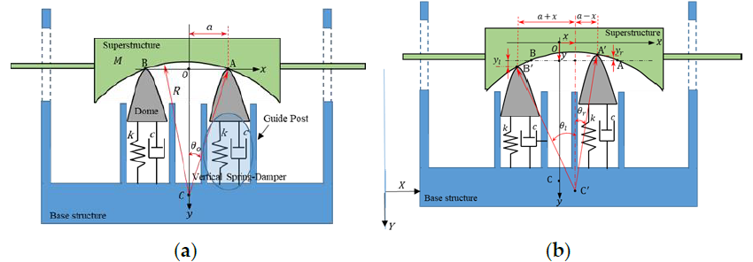
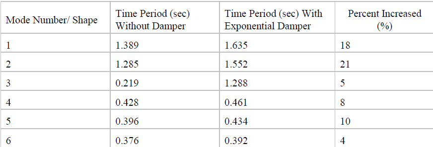
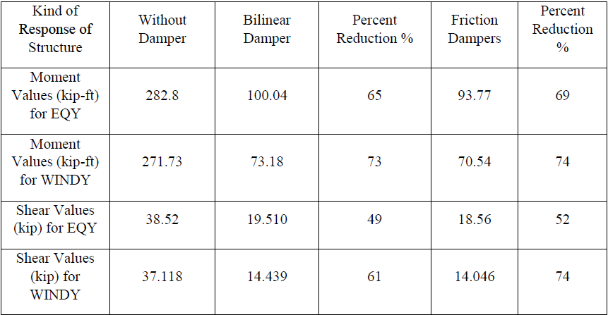

# Mass–Spring–Damper System — Final Report & Figures

A concise repository for our **Mass–Spring–Damper** design study. It hosts the **final report** and a **figure gallery** (ANSYS simulations, mechanism schematics, and literature tables) so reviewers can understand the project without needing code.

> 📄 **Report:** [`report/Mass-Spring-Damper-System-report.pdf`](report/Mass-Spring-Damper-System-report.pdf)  
> 🖼️ **Figures:** see the gallery below

> ℹ️ If you use different filenames or folders, update the paths in this README accordingly.

---

## Overview
- **Goal**: design and evaluate a spring–mass–damper for vibration mitigation and isolation.  
- **Process**: informed-design workflow → literature review → alternative concepts (Alpha, Kai, Phi) → selection → calculations → ANSYS FEA → redesign.  
- **Chosen design**: **Kai (ϗ)** using **high‑carbon steel**; selected for higher wear resistance and affordability relative to the alternatives.  
- **Key parameter highlights**:  
  - Damping coefficient `C = 80 N·s/m`, mass `M = 1 kg`  
  - Critical damping (design target) `K = C²/(4M) = 1600 N/m`  
  - Representative model equation: `x¨ + 80 x˙ + 1600 x = F(t)`  
- **Prototype geometry (for FEA)**: ~60 mm max height; wire Ø ≈ 3 mm; 10 coils; coil center radius ≈ 15 mm.

---

## Methods (short)
- **Pre-analysis**: hand calculations from standard texts (e.g., Shigley) to size stiffness/damping.  
- **Simulation**: ANSYS R16.x static & fatigue checks; mesh‑sensitivity with total deformation as reference (optimal element size ≈ 3 mm).  
- **Evaluation**: stress/strain/deformation fields; fatigue life/damage; safety factor across loads; qualitative redesign based on hot‑spots.

---

## Key findings (selected)
- Highest deformation appears under the loaded top plate and along outer spring turns; extreme shear bands align with load path.  
- Fatigue/safety‑factor maps indicate adequate margins within simulated load cases; redesign focuses on stress concentration at end coils.  
- From literature (context for our design choices):  
  - **Time period increases** with exponential/energy‑dissipating dampers (e.g., +18–21% in lower modes).  
  - **Response reduction** with dampers: moments ↓ ~65–74% and shears ↓ ~49–74% depending on device type and excitation.  

> The literature tables supporting these bullets are included in the gallery below.

---

## Figure gallery

<p align="center">
  
  
</p>

<p align="center">
  
  
</p>

**Literature tables** (for context):
<p align="center">
  
  
</p>

---

## Repository layout
```
.
├─ report/
│  └─ Mass-Spring-Damper-System-report.pdf
├─ images/
│  ├─ deformation-ansys.jpeg
│  ├─ shear-stress-ansys.jpeg
│  ├─ isolator-configuration.png
│  ├─ isolator-model.png
│  ├─ table-time-periods.png
│  └─ table-moment-shear-reduction.png
└─ README.md
```

---

## How to cite
If you reference this work, please cite the report:
```bibtex
@misc{group3_msd_2025,
  title        = {Mass–Spring–Damper System — Final Report},
  author       = {Group 3},
  year         = {2025},
  howpublished = {\url{https://github.com/<your-username>/<your-repo>}},
  note         = {Final report and figures}
}
```

---

## License
Choose and add a `LICENSE` file (e.g., **CC BY‑NC 4.0**, **MIT** for docs, or **All rights reserved**).

---

## Acknowledgement (optional)
Course: ME_3202, Dept. of Mechanical & Production Engineering, AUST (3rd year / 2nd semester).  
Add team member names here if you’d like them public.
